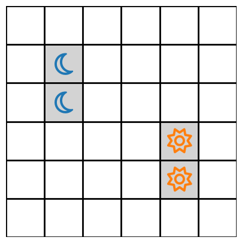
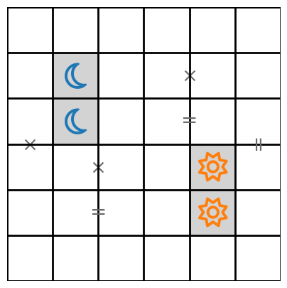
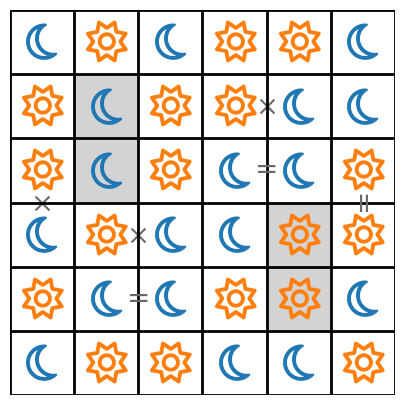

# Tango Solver

A Mixed Integer Linear Programme (MILP) solver for the Tango game on LinkedIn.

Mapping the Moon and Sun symbols to the binary values 0 and 1 respectively, we can "unravel" the $n \times n$ game grid in a vector of length $n^2$ by taking each row and appending them end on end resulting in the vector ${\bf x} \in \{0, 1\}^{\otimes n^2}$.

The constraint that dictates that there must be equal number of each symbols in the first row can be expressed as:

```math
[\underbrace{{\bf 1}_n^{T}, {\bf 0}_n^{T}, \dots , {\bf 0}_n^{T}}_{\times n }] {\bf x} = \frac{n}{2}
```

where ${\bf 1}_n = [\overbrace{1,1,\dots,1}^n]$ and ${\bf 0}_n = [\overbrace{0,0,\dots,0}^n]$. Similarly, the constaint for the $i^{\rm th}$ is the same as above with the vector ${\bf 1}_n^{T}$ shifted to position $i$. Succinctly, we can write all of the row constraints as 

```math
\left( {\mathbb I}_n \otimes {\bf 1}_n^{T} \right){\bf x} = \frac{n}{2} {\bf 1}_n
```

It is then straightforward to see that all the column constraints can be expressed as 

```math
\left( {\bf 1}_n^{T} \otimes {\mathbb I}_n \right){\bf x} = \frac{n}{2} {\bf 1}_n
```

Next, we deal with the constraints on "triples" – i.e. the symbols cannot appear in continuous lines greater than 2 characters. To encode this constraint, we define the vectors

```math
{\bf t}_1 = [1,1,1,\overbrace{0,\dots,0,0,0,0}^{n-3}] \\
{\bf t}_2 = [0,1,1,1,\dots,0,0,0,0] \\
\vdots \\
{\bf t}_{2n-3} = [0,0,0,0,\dots,1,1,1,0] \\
{\bf t}_{2n-2} = [0,0,0,0,\dots,0,1,1,1]
```

where the $n-2$ comes from the number of positions that the three 1 elements can occupy in a vector of length $n$. We combine these into the matrix 

```math
T := \begin{bmatrix} {\bf t}_1 \\
{\bf t}_2 \\
\vdots \\
{\bf t}_{2n-2}
\end{bmatrix}
```

The triples constraints can now be formulated in matrix form as 

```math
\begin{bmatrix} 
    {\mathbb I}_n \otimes T \\
    T \otimes {\mathbb I}_n
\end{bmatrix} {\bf x}  < 3 {\bf 1}_{4n-4} 
```
```math
\begin{bmatrix} 
    {\mathbb I}_n \otimes T \\
    T \otimes {\mathbb I}_n
\end{bmatrix} {\bf x}  > {\bf 0}_{4n-4}
```

Finally, we need to encode the "cross" and "equal" constraints that bound the neighbouring cells to be either the same or different. For an equality constraint between cells $i$ and $j$, we can write this as

```math
({\bf e}_i - {\bf e}_j) {\bf x} = 0
```

whereas a cross constraint between cells $i$ and $j$ would be 

```math
({\bf e}_i + {\bf e}_j) {\bf x} = 1
```

To input a puzzle, we express the given cells of the game as numpy array in the following format:

```code
np.array([
    [np.nan, np.nan, np.nan, np.nan, np.nan, np.nan],
    [np.nan,      0, np.nan, np.nan, np.nan, np.nan],
    [np.nan,      0, np.nan, np.nan, np.nan, np.nan],
    [np.nan, np.nan, np.nan, np.nan,      1, np.nan],
    [np.nan, np.nan, np.nan, np.nan,      1, np.nan],
    [np.nan, np.nan, np.nan, np.nan, np.nan, np.nan]])
```

which gives the following game



We add the cross and equal constraints in the following format:

```code
cross_constraints = [
    [(2,4), (2,5)],
    [(3,1), (4,1)],
    [(4,2), (4,3)],
]
equal_constraints = [
    [(3,4), (3,5)],
    [(3,6), (4,6)],
    [(5,2), (5,3)]
]
```

which gives the complete game:



Once the above constraints are added, we can run a Mixed Integer Linear Programme to solve the game. The result for this example is the following 


